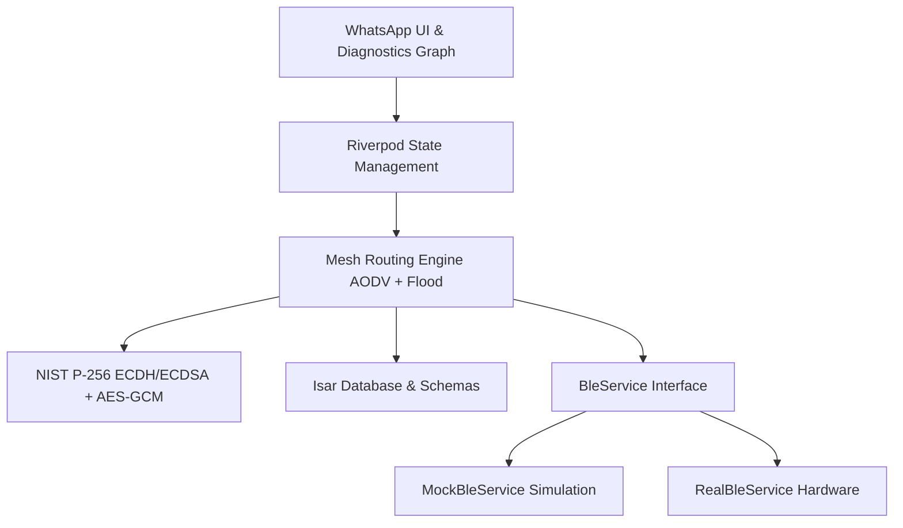

# BitChat Mesh

A production-ready, **completely offline Bluetooth Low Energy (BLE) Mesh Chat Application** built with Flutter, Riverpod, and Isar.

BitChat Mesh creates a decentralized, self-healing peer-to-peer network between nearby devices. Every device acts as a **Client, Router, and Relay**, allowing encrypted messages to travel multiple hops across the network without relying on internet, Wi-Fi, cellular data, or central servers.

---

## 🚀 Key Features

*   **100% Offline P2P Mesh**: Automatically discovers and communicates with nearby devices using Bluetooth Low Energy (BLE). No GPS, cellular data, or server setup required.
*   **AODV Multi-Hop Routing**: Automatically calculates dynamic multi-hop routing paths. Messages jump across intermediate nodes to reach peers outside direct BLE range.
*   **End-to-End Encryption (E2EE)**:
    *   **ECDH (NIST P-256)**: Cryptographic key agreement to derive shared AES secrets.
    *   **AES-256-GCM**: End-to-end payload block cipher encryption.
    *   **ECDSA Signatures**: Digital signatures appended to every packet to verify sender identity and prevent spoofing/tampering.
*   **WhatsApp-like UI/UX**:
    *   Material 3 Light and Dark themes with signature green highlights.
    *   Active Chat dashboard with last message previews and unread badges.
    *   Chat bubbles showing real-time delivery state checkmarks (Sent, Delivered/ACK, Read).
    *   Swipe-to-Reply gestures with haptic feedback.
    *   Emoji long-press reaction sheet.
*   **Media & File Chunking**: Select any file via file picker. Large payloads are split into custom fragments, routed through the mesh, and reassembled with progress tracking at the receiver.
*   **QR Pairing & Cryptographic Trust**: Verify peer identities offline by scanning QR codes containing their public keys.
*   **Topology Diagnostics Canvas**: Live CustomPainter force-directed canvas graph showing active nodes, link signal strength (RSSI), and animated glowing dots that trace packet travels.
*   **In-Memory Simulator**: Toggle Developer Options to spin up virtual nodes (`Alice`, `Bob`, `Charlie`) in a simulator to test multi-hop traversal with absolute ease.

---

## 📐 Architecture Overview



### Protocol Packet Specification
All packets routed through the mesh are serialized JSON packets:
```json
{
  "id": "packet-uuid",
  "senderId": "sender-user-id",
  "receiverId": "receiver-user-id-or-ALL",
  "type": "MSG | RREQ | RREP | ACK | HEARTBEAT",
  "ttl": 7,
  "hopCount": 0,
  "payload": "encrypted-base64-content",
  "signature": "ecdsa-signature-base64",
  "chunkIndex": 0,
  "totalChunks": 1,
  "path": ["node1-id", "node2-id"]
}
```

---

## 📂 Project Structure

```
lib/
├── main.dart                  # App bootstrap and state initialization
├── core/
│   ├── theme/                 # AppTheme (Material 3 Dark/Light styling)
│   ├── utils/                 # Hash helpers and string utilities
│   └── services/
│       ├── providers.dart     # Centralized Riverpod state providers
│       ├── ble/               # Real BLE wrapper and MockBLE Simulator
│       ├── database/          # Isar DB manager and model schemas
│       └── encryption/        # Cryptography wrapper (PointyCastle)
└── features/
    ├── mesh/                  # AODV protocol and chunk fragmentation
    ├── chat/                  # Chats list, ChatScreen, bubbles, swipe gestures
    └── settings/              # Profiles, QR pairing, and Diagnostics Canvas
```

---

## 🛠️ Installation & Setup

### Prerequisites
*   Flutter SDK (v3.22.0 or higher recommended)
*   Android SDK / Xcode

### 1. Fetch Dependencies
```bash
flutter pub get
```

### 2. Generate Database Schemas
Isar requires code generation to build binary database adapters. Run build runner:
```bash
flutter pub run build_runner build --delete-conflicting-outputs
```

### 3. Run the App
To start the app on an Android device or simulator:
```bash
flutter run
```

---

## 🧪 Testing & Verification

The project is backed by a 100% passing test suite covering encryption, local database models, mock BLE position scanning, AODV routing, and Riverpod notifier states.

Run all tests:
```bash
flutter test
```

### Test Directory Layout
*   `test/crypto_service_test.dart`: NIST P-256 Keygen, ECDH secrets, AES-GCM, and ECDSA signature verifiers.
*   `test/database_service_test.dart`: Transaction checks, schema validations, query watchers.
*   `test/ble_service_test.dart`: Coordinates RSSI signal decay and connection states.
*   `test/mesh_router_test.dart`: Integrates routing, multi-hop relaying (`Alice <-> Bob <-> Charlie`), and reassembly.
*   `test/providers_test.dart`: Riverpod state emission and BLE mode switching.
